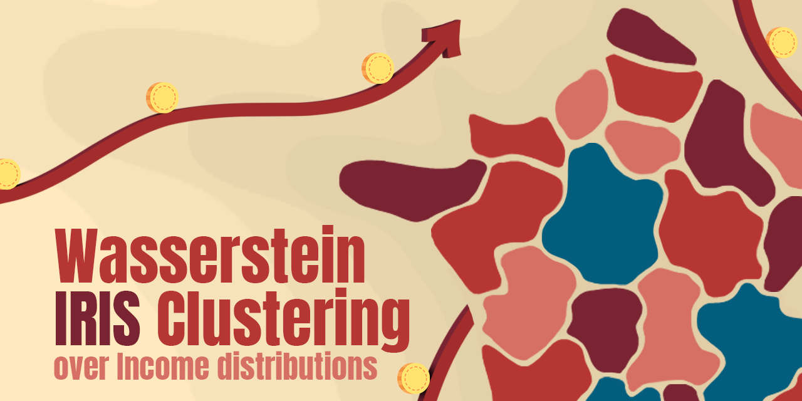

 

  

<h1>Wasserstein Clustering of French IRIS</h1>

<h2>📌 Project Overview</h2>

This project applies <b>Wasserstein K-means clustering</b> to analyze the heterogeneity of French IRIS (small geographical areas defined by INSEE) based on income distributions.
Each IRIS is described by income deciles, which capture the full shape of the distribution instead of reducing it to a single summary statistic such as the mean or median. This distributional perspective enables the identification of richer and more meaningful clusters than those obtained with standard K-means.

We explore two main approaches:

<ul>
  <li><b>Centroid-based Wasserstein K-means (bary_WKM)</b>, which builds clusters around Wasserstein barycenters.</li>
  <li><b>Distance-based Wasserstein K-means (dist_WKM)</b>, which relies on pairwise Wasserstein distances.</li>
</ul>

Both approaches are inspired by the methodology introduced by Yubo Zhuang et al. (2022).

The project is organized around two main notebooks:

<h3>📒 <code>IRIS.ipynb</code></h3>

This notebook focuses on <b>income-only distributions</b>. It applies barycenter-based Wasserstein K-means (bary_WKM) and compares the outcomes with classical K-means, highlighting the added value of clustering full distributions rather than relying on a single indicator.

<h3>📒 <code>IRISxAGE.ipynb</code></h3>

This notebook extends the analysis to <b>joint income–age distributions</b>, providing a more detailed view of population structures. Both bary_WKM and dist_WKM are implemented, but the focus is placed on dist_WKM, which yields more stable and interpretable results. The notebook also explores the geographical distribution of clusters, first at the national scale and then with a zoom into Paris.

<h2>📂 Repository Structure</h2>

<pre>
├── data/ 
├── notebooks/
│   ├── IRIS.ipynb
│   └── IRISxAGE.ipynb
├── src/
│   ├── __init__.py             # Marks src as a Python package  
│   ├── utils.py                # Helper functions (normalization, plotting, etc.)  
│   └── clustering_methods.py   # Implementation of clustering methods  
└── README.md 
</pre>

<h2>📊 Results</h2>

<ul>
  <li>For income-only clustering, bary_WKM revealed negligible differences compared to classical K-means. This is mainly because the median already explains most of the income distribution, while the other deciles only refine the information without creating major differences for clustering.</li>
  <li>When extending to joint income–age distributions, dist_WKM proved more effective than bary_WKM, which tended to collapse clusters prematurely.</li>
  <li>Geographical mapping showed limited spatial patterns at the national scale, largely due to the partial coverage of available IRIS data. However, clearer structures emerged when zooming into Paris, where strong differences appeared between clusters obtained at the national level and those derived from a Paris-only clustering.</li>
</ul>

<h2>📚 References</h2>

<ul>
  <li>
    <b>William, A. (2020). <i>A Short Introduction to Optimal Transport and Wasserstein Distance</i>.</b> 
    This introductory document was the first resource I used to become familiar with Wasserstein distances, which are central to optimal transport. Peyré and Cuturi’s lecture videos also provide excellent introductory material.
  </li>
   
  <li>
    <b>Zhuang, Y., et al. (2022). <i>Wasserstein k-means for clustering probability distributions</i>.</b> 
    This paper introduces the Wasserstein k-means algorithm and motivates the idea of clustering full distributions instead of reducing them to summary statistics. It provides the conceptual foundation for both the barycenter-based and distance-based approaches explored in this project.
  </li>
   
  <li>
    <b>Okano, D. & Imaizumi, M. (2024). <i>Wasserstein k-Centers Clustering for Distributional Data</i>.</b> 
    This more recent work extends the field by studying Wasserstein k-centers, offering new perspectives on clustering stability and computational strategies. While not directly implemented in our project, the method proposed by Okano and Imaizumi represents a promising direction for future research.
  </li>
</ul>

This project has been supervised by <b>Vincent Divol (CREST)</b>.

